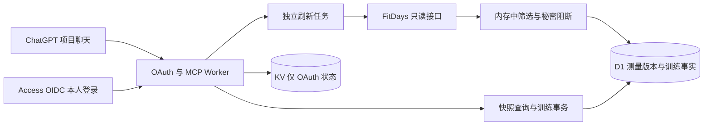

# Kinetrail（身迹）架构决策

日期：2026-09-14。状态：**离线研究定案；真实数据与上线资格未验证**。

本轮完整阅读原任务书。文档中的建议和历史“已核实”陈述作为待检验材料，不作为已执行授权。用户随后明确：真实凭据尚未配置，先交付离线 spike、fixture 驱动测试与架构文档，保留真实验证 gate；目标 ChatGPT Project 是“减肥计划”。本轮未部署、未登录 FitDays、未接触真实健康数据，也未编写生产服务。

## 决策

**V1 实现目标选择 Cloudflare Worker + D1 + OAuth Provider 的 KV + Cloudflare Access OIDC。** 这是离线证据支持的实现选择，不是云端上线验收通过。Node 22 Docker + SQLite 作为明确回退路线。若真实 CN 网络、资源上限或鉴权 gate 失败，先用最小复现确认，再切换；不能为了守住预选平台截断测量数据。

理由：SDK 的 crypto、UUID、fetch、数值无损 JSON、MCP Web Standard transport 已在 workerd 实际通过；D1 raw 往返和 batch 约束失败回滚通过；Provider 已完成本地合成 OAuth 授权码/PKCE/降权测试。Worker 减少单用户常驻服务器运维。真实六年数据规模、CPU/内存、Access 登录、CIMD 和 ChatGPT 回调未验证，保留阻断上线的 G1–G5。

### 组件取舍

| 组件 | 决定 | 放弃项与理由 |
| --- | --- | --- |
| FitDays | 固定 `fitdays-api@1.0.4`，自有小适配层注入 `fetchImpl`，调用公共 `request()`；不 fork | 不 fork 两个仓库，不延续摘要/内存缓存/stdio 子进程体系；现有扩展点够用 |
| MCP | 直接用 SDK 的 Web Standard Streamable HTTP；V1 无 UI | 不使用 supergateway 和常驻子进程；不引入 Agents、Durable Object 仅为协议包装 |
| 数据库 | D1 保存测量版本、批次、索引、训练版本/事件/幂等结果 | KV 最终一致性不适合事实、锁或幂等；不从 KV 读取即时训练结果 |
| KV | 仅 Provider 所需 `OAUTH_KV` | 不存 FitDays 密码、邮箱、token；OAuth 状态属于独立受保护域，不属于 raw_records |
| R2 | 暂不需要 | 原始记录超出 D1 单行限制时优先 D1 分块；加密离站备份目标由部署阶段指定，不为预期规模先加对象存储 |
| 身份 | Access for SaaS OIDC，固定本人 `(issuer, sub)` 白名单 | 不自建密码库。不能直接把 Access HTML 登录墙挡在 MCP/token/metadata 前，也不能把 Access token 当 MCP token |
| Node 回退 | Node 22.23.2 + 单容器服务 + SQLite WAL + TLS 反代；外部标准 OAuth AS | Docker 本机未安装，镜像、AS 和部署全部未验证；不因 JS 在 Node 22 跑通就标 Docker 通过 |

Worker 内存上限为 128 MB；免费 CPU 预算远低于付费档。不能根据 1 KB 合成样本推算真实账户一定适合免费档。[Workers 限制](https://developers.cloudflare.com/workers/platform/limits/)

D1 单行/字符串/BLOB 上限 2,000,000 bytes，单查询最多 100 个绑定参数；事务使用固定 `batch()`，不能模拟跨请求 BEGIN/COMMIT。将单份 raw 文本按 256 KiB 分块，manifest 保存完整哈希和长度；先写分块，原子发布完整版本，未发布块不可查询。事务的 CAS、冲突回滚、发布原子性仍须在最终 D1 schema 验收。[D1 限制](https://developers.cloudflare.com/d1/platform/limits/)、[D1 Database API](https://developers.cloudflare.com/d1/worker-api/d1-database/)

KV 不用于训练 read-after-write、唯一性判定或分布式锁。[KV 一致性](https://developers.cloudflare.com/kv/concepts/how-kv-works/)

## 当前上游证据

2026-09-14 通过匿名 HTTPS clone 并读源码，两个 checkout 保持无改动。第三方参考位于 `Workspace/vendor/`，不混入项目实现。

| 仓库 | HEAD /提交时间 | 当前包与实现 |
| --- | --- | --- |
| [fitdays-api](https://github.com/roquerodrigo/fitdays-api/tree/e448d72db0a2f7cea88a4e4a1fd63681b730d7d0) | `e448d72db0a2f7cea88a4e4a1fd63681b730d7d0` / 2026-09-07T19:14:36-03:00 | 1.0.4；Node >=22；无运行时依赖；MIT；lockfile v3 |
| [fitdays-mcp-server](https://github.com/roquerodrigo/fitdays-mcp-server/tree/143207e5c4d32874e14fc09e1742d01370ac8485) | `143207e5c4d32874e14fc09e1742d01370ac8485` / 2026-09-10T07:00:43-03:00 | 1.2.0；SDK 1.30.0、fitdays-api 1.0.4、zod 4.4.3；MIT；lockfile v3 |

源代码修正了任务书的部分假设：

- MCP `src/index.ts` 是 **stdio**；Dockerfile 的 `supergateway@3.4.3` 包装 Streamable HTTP，当前基镜像是 `node:26-slim`，不是 Node 22。镜像并未按 digest 固定。
- SDK README 提及 `loginWithPhone()`，但当前导出的类并无此方法；只有 `login(email,password)` 向 login body 发送 `email`。手机号能否放在该字段登录 **未验证**，不能承诺支持或猜 phone endpoint。
- SDK `request()` 已公开，能避开 `parseSyncFromServerData()`；但仍先 JSON.parse。严格数值保真必须在 fetch response text 层捕获。
- `parseSyncFromServerData()` 把缺失/null 列表改成 `[]`，且 malformed ext_data 会抛错终止整批。已用 mock 复现。
- `request()` 对 JSON `code:302` 无域名白名单、无跳数上限地递归；HTTP redirect 又默认跟随。所有调用先经固定 HTTPS origin/path 白名单、`redirect:manual`、总跳数/超时/字节预算后才能发送。已验证恶意第二跳未发送。
- `FitDaysApiError.response` 保存完整响应，非 JSON 错误 message 带响应前缀；上游示例的 `console.error(err)`、签名 URL 日志及 test-sync 原始落盘路径禁止复制。
- 上游五个工具裁剪字段、设备工具暴露 MAC、history 默认包含删除记录、查询会懒加载全量同步。这些语义不继承。
- refreshToken 仅被接收并存入 session，未找到刷新方法；token 有效期、失效代码、真实编辑/删除行为均 **未验证**。
- `syncAll()` 实际为 2160 天，不是从账户起点开始的“全部历史”。首次同步必须指定明确起点并验证覆盖范围。

不依赖 `nibu147/fitdays-mcp-worker`：没有取得可审计代码；本次网页请求失败也不证明它当前可读，继续排除。

### 依赖与许可证

spike 固定 Provider 0.10.3、SDK 1.30.0、FitDays 1.0.4、Zod 4.4.3，Inspector 2.6.0、esbuild 0.28.2、Miniflare 5.20260911.1-alpha；准确解析版本/完整性在 `research/spike/package-lock.json`。上游 MCP 运行时 lock 审计和本轮全部 spike 依赖审计均为 0 个已报告漏洞，见 `research/*audit.json`；这不等于不存在漏洞。

Miniflare 4.20260730.0 曾被审计检出 sharp/undici 高危项，改用当前修复的 alpha 后重跑通过。5.x 需官方 `convertV4MiniflareOptions`，旧 README 简例不能直接当新 API。宿主 Node 24.16.0 下 Inspector 在输出后出现 Windows libuv 退出崩溃；Node 22.23.2 同样流程正常退出。因此复现命令固定 Node 22。生产无 Inspector/Miniflare。

两个上游 MIT 允许复用，但分发复制的代码须保留版权及许可文本。完整第三方清单由 lock 实际依赖生成，禁止用“顶层 MIT”代表所有传递依赖。FitDays API 的服务条款/逆向访问许可与开源代码许可证是两回事；真实条款接受性 **未验证**，不作法律结论。

## OAuth 定案

以 `https://<部署域名>` 为 issuer，resource 精确为 `https://<部署域名>/mcp`。地址为占位方案，不代表已部署。

| 路径 | 实现与边界 |
| --- | --- |
| `/.well-known/oauth-protected-resource/mcp` | Provider 提供 RFC 9728 metadata；最低只读 scopes，不能无差别要求写权限 |
| `/.well-known/oauth-authorization-server` | Provider 提供发现；S256、真实 client 方法、准确 issuer |
| `/authorize` | handler 验证 client/redirect/resource/PKCE；上游本人登录后展示明确 consent |
| `/callback` | Access OIDC 回调；校验 state/nonce、签名、iss/aud/exp 与本人 sub；上游 token 不进入 MCP |
| `/oauth/token` | Provider 授权码交换、刷新；验证资源绑定；撤销按其实际 metadata 指定 endpoint |
| `/mcp` | Provider 先验 token，然后每工具检查当前 token.scope 与 owner；不是 grant.props 中旧 scopes |
| `/healthz` | 自有探活，只返回存活状态，不调用 FitDays，不暴露身份/数据；不是 OpenAI 强制标准路径 |

Access 的 OIDC authorization/token/JWKS 路径从实际控制台复制，当前形式为团队域名下 `/cdn-cgi/access/sso/oidc/<CLIENT_ID>/{authorization,token,jwks}`。部署时先走本人身份绑定，不能用模型提供的 email 或 `_meta.openai/subject` 作为授权证据。[Cloudflare MCP 身份方案](https://developers.cloudflare.com/cloudflare-one/access-controls/ai-controls/secure-mcp-servers/)

优先 CIMD；`clientIdMetadataDocumentEnabled:true` + `global_fetch_strictly_public`，保留静态预注册回退；不默认开 DCR。MCP 2026-07-28 已把 DCR 留作向后兼容。公开发现、resource 参数、每请求 bearer 和 audience 校验是协议义务。[MCP 2026 授权](https://modelcontextprotocol.io/specification/2026-07-28/basic/authorization)

OpenAI 当前文档支持 CIMD 的 `none`/`private_key_jwt`。Provider 0.10.3 的 CIMD 路径采用 `none`，不得宣称支持未测方法。ChatGPT 回调必须复制连接界面实际值；稳定回调 `https://chatgpt.com/connector_platform_oauth_redirect` 与 `https://chatgpt.com/oauth/client.json` 的适用前提包含正确 RFC 9207 issuer 响应。真实连接、错误回调、CIMD 抓取均未验证。[OpenAI Authentication](https://developers.openai.com/plugins/build/auth)

注意版本差异：GitHub main 已出现 `validateToken()`，安装的 0.10.3 暴露的是 `env.OAUTH_PROVIDER.unwrapToken()`；用其 `scope` 建权限上下文，**不能用 `grant.scope` / `grant.props.scopes`**。本地 downscope 测试已验证。Provider 的 opaque token 不按 JWT 解码；由固定 issuer 的 Provider 校验存在性/有效期和 audience。OIDC JWT 才做签名/iss/aud/exp 验证。[Provider 项目](https://github.com/cloudflare/workers-oauth-provider)

## 同步与失败策略

只有 `refresh_data` 和后台定时刷新会访问 FitDays 并写镜像；所有查询只读已发布快照，缺少数据返回 EMPTY，过期返回 stale。默认不在 read 工具里偷偷重登/拉取。

第一版候选：增量重叠 7 天、每周一次指定起点至今的 reconciliation；这是待真机校准的策略值，不是已证明可靠的 API 保证。`start_time` 映射 newest，`end_time` 映射 oldest，源码已证实映射，服务端包含端点/截断/分页未验证。保留窗口 manifest、记录数、coverage 状态；缺失记录不推断为删除。来源明确 tombstone 才产生新删除版本。

一次同步先 staged 写完整记录版本，全部校验后发布批次；中途失败不推进 checkpoint，不让查询见到半个新快照。数据库 lease + fencing generation 防止重叠刷新及旧任务晚到覆盖新结果；不拿 KV 充当锁。普通刷新冷却 60 秒、full 24 小时；每次请求 15 秒、整个任务 120 秒、上游最多两次有限退避重试，值均需真实 gate 校准。鉴权失败只允许一次重新登录；不猜 refresh endpoint。

真实凭据只通过 `SecretReader` 接口：`FITDAYS_LOGIN`、`FITDAYS_PASSWORD`、`FITDAYS_REGION`（cn）。Worker 用 Secret bindings；Docker 用只读 `/run/secrets/...`。不用普通 `.env`、tool 参数或 CLI 参数。登录结果/token/等价密码摘要仅存请求内存；日志禁完整 URL、body、headers、上游 error 对象。阻断重定向不需泄露目标 URL，仅记稳定错误码。[Workers Secrets](https://developers.cloudflare.com/workers/configuration/secrets/)

## 备份、恢复与回退

D1 Time Travel 免费 7 天、付费 30 天；它不是长期独立备份。[Time Travel](https://developers.cloudflare.com/d1/reference/time-travel/)

实施要求：每日加密导出（公钥加密，解密私钥不在 Worker），保留最近 30 个日备份及 12 个月备份，存入用户确认的独立存储；恢复到隔离数据库，校验记录数、raw hash、事件链、幂等收据和查询结果后切换 binding。恢复会改变数据，须具体审核。彻底删除需撤销 OAuth、移除 DB/分块/备份并等待平台保留期，不能声称单条 SQL 已清除所有副本。当前导出/恢复演练 **未验证**。

若 Worker gate 失败：同样的 raw/event contract 放到 SQLite，Node 22 直接 Streamable HTTP，不采用上游 stdio 网关。AS 优先托管标准 OAuth（例如 Auth0 的静态公开客户端，具体计划/配置未验证），复用 Access OIDC 也必须补独立 AS；不把 OAuth Provider 当通用 Node 包。若不愿增加托管 AS，需单独评估 oidc-provider，不能在本阶段宣布完成。SQLite 单实例 WAL、在线备份 API 和加密离站副本；不是直接拷贝运行中的 db 文件。

CSV 降级是新增 `source=manual_fitdays_csv` 导入适配器，经过相同归一化/趋势层，记录列名、单位与缺失指标。CSV 无法提供原始阻抗等未导出字段时显式 `coverage=partial`，不冒充 FitDays full。同样不得将 CSV 中计划或建议导成训练事实。

## 验证与阻断关卡

| 项目 | 本轮状态 | 证据/剩余条件 |
| --- | --- | --- |
| SDK raw/parsed、未知字段、null/missing/[]、错误 JSON | 已验证，合成 | `research/spike/fitdays-check.mjs` |
| 数值 lexeme、MD5/UUID/fetch | 已验证，Node 22 + workerd | `research/spike-results.json` |
| Inspector tools/list + read | 已验证，Node HTTP + Worker | `research/node-results.json`；Worker 使用回环代理内存注入合成 token |
| OAuth 发现、S256、code replay、invalid bearer、错误 audience、降权 | 已验证，本地静态 client/合成身份 | `research/spike/check.mjs`；不是 Access/CIMD/ChatGPT 验收 |
| 训练 record→append→amend→finalize→read/reopen | 已验证，SQLite fixture | `research/spike/core-check.py`；不是 MCP 训练生产全链 |
| D1 raw 往返、batch 失败回滚 | 已验证，workerd 模拟 D1 | 最终 D1 训练事务及并发 CAS **未验证** |
| G1 真实 CN | **未验证/阻断** | 用户未配置 Secrets；列表字段/数据量/join/分页/边界/token/增量/全量/账号条款 |
| G2 生产资源与恢复 | **未验证/阻断** | 云端峰值 CPU/内存、大小、D1事务、加密备份恢复、日志泄漏扫描 |
| G3 真实 OAuth | **未验证/阻断** | Access 本人、CIMD、精确回调、刷新降权、撤销、过期与错误 issuer、外部限流 |
| G4 “减肥计划”双聊天 | **未验证/阻断** | 项目链接待提供；工具可见性、选择来源、同意、训练写入及新聊天查询 |
| G5 事实选择与重试 | **未验证/阻断** | ChatGPT 对完成/计划/引用/否定的实际选择，超时丢收据和同键重放 |

OpenAI 当前入口为 Settings → Security and login → Developer mode，再到 Plugins 添加 MCP；是否开放由账户及 workspace policy 决定。文档要求新聊天从工具菜单加入连接；项目共享来源并不是每个聊天自动调用工具的保证。[连接测试](https://developers.openai.com/plugins/deploy/connect-chatgpt)、[Projects](https://learn.chatgpt.com/docs/projects)

## 第 11.1 节逐项对应

1/11/13：本文件 OAuth 与接入、MCP_CONTRACT；2：具体端点与 Access；3/4/5：组件、spike 和回退；6/7：上游审计与 DATA_CONTRACT；8：字段清单仅源码/合成，真实明确未验证；9/10：同步策略及 MCP 限制；12：非官方风险/CSV；14–17：MCP_CONTRACT 的幂等、状态机与单位；18：DATA_CONTRACT 的可复现统计口径。

架构关键假设已由显式调用的 GPT-6 Astra `ultra` 子代理只读复核；主代理完成上游检查、spike 和文档整合。未调用 Opus 5。最高档调用不代替任何实测证据。
