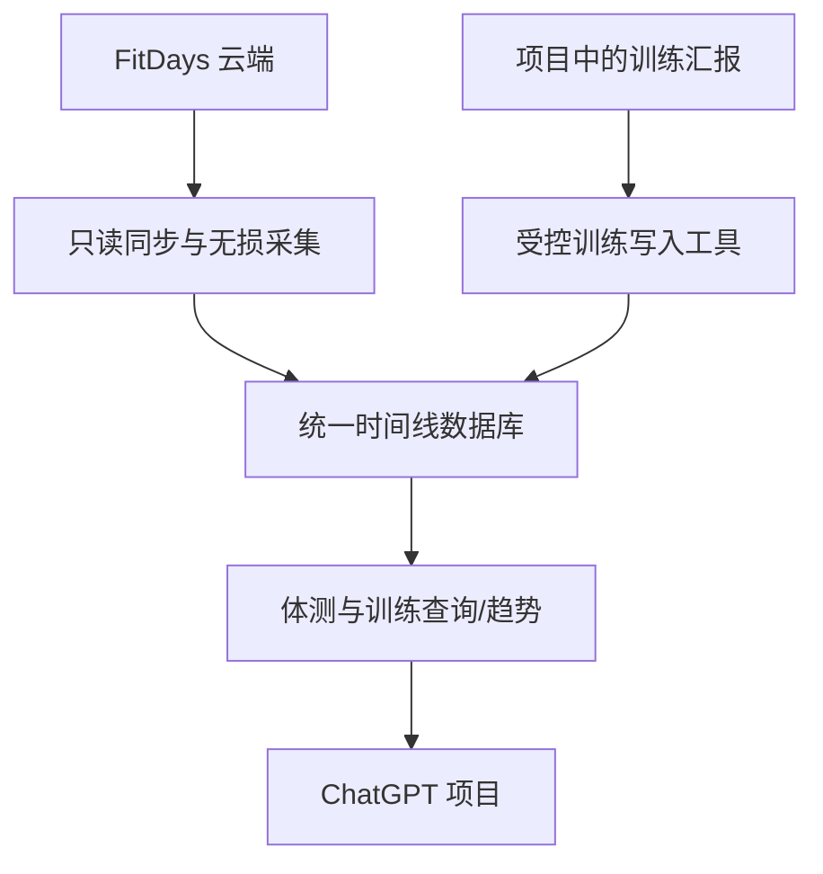
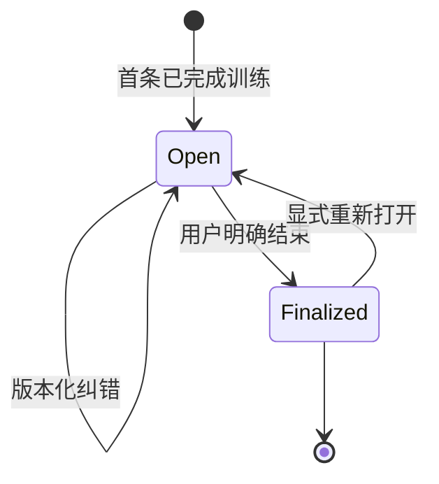

# Kinetrail

## 个人体测与训练数据连接器——技术方案与 Astra 研究任务书

- 文档版本：0.2
- 日期：2026-09-14
- 项目名：**Kinetrail（身迹）**（Kinetic + Trail，意为“身体运动与变化的长期轨迹”）
- 目标用户：单用户自用（Erika）
- 后续分工：GPT-6 Astra 负责研究与架构定案；Opus 5 负责按定案实现

---

## 1. 项目结论

要做的不是一个“把几项体重数据传给 ChatGPT”的普通连接器，而是一个**私有、可审计的个人身体与训练时间线**：无损同步 FitDays 体测，并把用户在项目聊天中明确报告为“已完成”的训练持久化。以后分析依赖数据库，不依赖模型对历史聊天的记忆。

目标链路：



核心设计原则：

1. **完整指“完整测量数据”，不包括账户令牌和登录凭据。** `account.token`、`refresh_token`、密码、手机号、邮箱、OpenID 等不得暴露给模型，也不应混入普通原始记录库。
2. **原始数据层与分析层分离。** 原始测量字段尽量按服务端响应保存；趋势接口返回紧凑、统一口径的数据，不能每次把数年的巨大 JSON 塞进模型上下文。
3. **未知字段也必须保留。** FitDays 将来新增字段时，即使代码尚未认识它，完整查询仍应能够读取。
4. **对 FitDays 永远只读；只向自己的训练库写入。** 两条权限边界不能混淆。
5. **连接器必须鉴权。** 这是健康数据，不能依赖“URL 很难猜”或公开匿名 MCP。
6. **先做单用户版本。** 不为并不存在的多租户需求增加账户体系、计费和管理后台。
7. **事实、计划、建议严格分开。** 只有用户明确说已经完成的训练才能写入；“明天练腿”“建议做三组”等不得记为事实。
8. **训练写入必须幂等、可修订、可审计。** 工具重试不能生成重复训练，纠错不得悄悄覆盖原值。

---

## 2. 背景与已核实事实

截至 2026-09-14，已检查以下两个上游项目：

- [`roquerodrigo/fitdays-api`](https://github.com/roquerodrigo/fitdays-api)，检查提交 `e448d72db0a2f7cea88a4e4a1fd63681b730d7d0`。
- [`roquerodrigo/fitdays-mcp-server`](https://github.com/roquerodrigo/fitdays-mcp-server)，检查提交 `143207e5c4d32874e14fc09e1742d01370ac8485`。

两者均为 MIT 许可证，但 FitDays 接口本身是**非官方逆向接口**，不受 FitDays 官方兼容性承诺保护。

### 2.1 `fitdays-api` 已经能提供什么

SDK 支持邮箱/手机号登录、`cn` / `eu` / `us` 区域，并能调用 `syncFromServer`。目前已知同步响应包括：

- `weight_list`
- `impedance_list`
- `hr_list`
- `balance_list`
- `gravity_list`
- `height_list`
- `rulers_list`
- `skip_list`
- `devices`
- `bind_device`
- `users`
- `products`
- `account`

`weight_list` 已有较完整类型，包含 `adc`、`adc_list`、`electrode`、`imp_data_id`、`balance_data_id`、`gravity_data_id`、`data_calc_type`、`source` 等底层字段，以及 `bfr`、`rom`、`rosm`、`vwc`、`pp`、`sfr`、`uvi`、`bm`、`bmr`、`bodyage` 等体成分字段。

`ext_data` 还包含 SMI、腰臀比、身体评分、身体类型、目标值、参考区间、设备信息、围度和原始阻抗字符串等信息。

### 2.2 现成 MCP 为什么不能直接作为最终成品

现成 `fitdays-mcp-server` 的优点是已经实现 Node 22、Streamable HTTP、5 分钟内存缓存和五个基础工具：

- `list_users`
- `list_devices`
- `get_weight_history`
- `get_latest_weight`
- `refresh_sync`

但它会通过 `summarizeWeight()` 裁剪字段，且没有暴露 `impedance_list`、`hr_list`、`balance_list`、`gravity_list`、`rulers_list` 等数据集。它可以作为协议和业务逻辑参考，但不能满足本项目的“完整测量数据”要求。

### 2.3 “无损”还有一个容易漏掉的问题

当前 SDK 会：

- 将 `weight_list[].ext_data` 从原始 JSON 字符串解析为对象；
- 将服务端缺失或为 `null` 的列表统一变成空数组。

这有利于日常开发，但会丢失部分 wire-level 信息。真正的无损采集必须在标准化之前保留原始测量响应，或给 SDK 增加 `syncFromServerRaw()` / 响应拦截能力。至少应同时保留：

- `ext_data_raw`
- `ext_data_parsed`
- 原始字段是否缺失、为 `null` 或为空数组的区别（如研究确认这些差异有实际意义）

### 2.4 关于曾被提及的 Worker 项目

此前资料提到 `nibu147/fitdays-mcp-worker`，但本次检查时 GitHub 仓库已返回 404/不可匿名读取。因此**不能把它当成可依赖的代码基线**。Astra 可以参考公开描述里的思路，但必须从可审计、可固定提交的上游开始。

---

## 3. 产品目标

完成后，用户应能在 ChatGPT 中直接说：

- “刷新并读取我今天的完整体测。”
- “分析最近四周减脂趋势，并和上四周比较。”
- “查看 9 月 14 日这次称重对应的原始阻抗和设备信息。”
- “列出这段时间所有有效记录，同时保留被 FitDays 标记删除的记录供排查。”
- “我到健身房了，开始今天的背部训练。”
- “高位下拉 45 kg，12、12、10 次；坐姿划船 40 kg，3 组 12 次。”
- “训练结束。把今天的内容存下来。”
- “比较最近八周的训练频率、训练量、力量表现和体重/体脂趋势。”

ChatGPT 应能得到完整、可追溯的数据，但默认只获取完成回答所需的最小数据量。换一个新聊天后，训练历史仍应可从 Kinetrail 查询；不能把“项目记忆”当成事实数据库。

### 3.1 必须实现

- 从 FitDays 中国区账户自动读取数据；区域仍须做成配置项，并验证是否存在服务器 302 重定向。
- 首次完整同步，后续增量同步，并有周期性全量校准机制。
- 无损保留所有测量数据集中的已知和未知字段。
- 把重量记录和阻抗、心率、平衡、重心等关联记录做 best-effort 关联。
- 提供最新完整体测、区间体测、趋势、原始数据集、同步状态等 MCP 工具。
- 提供训练会话的开始/追加/结束、修订、历史查询和趋势工具。
- 支持一次训练中多轮聊天增量记录，并把它们归入同一个 open session。
- 支持力量训练的逐组重量/次数/RPE/RIR，也支持跑步、单车、划船机等时长/距离/速度/坡度/阻力。
- 保存用户原始表述和结构化解析结果，确保后续能纠错和重新解析。
- 记录场馆与器械标识；不同器械的重量默认不能直接视为同一力量序列。
- HTTPS Remote MCP，使用 Streamable HTTP。
- OAuth 2.1 鉴权，符合 OpenAI 当前 MCP 鉴权要求。
- FitDays 查询工具只读；训练写工具最小授权、幂等、可修订、限流并错误脱敏。
- 自动化测试、脱敏 fixture、部署文档和恢复文档。

### 3.2 暂不实现

- 修改或删除 FitDays 云端记录。
- 自动把训练计划、助手建议或含糊表达写成已完成训练。
- V1 物理删除训练记录；纠错采用版本化修订和审计日志。
- 面向公众发布或多租户 SaaS。
- 医疗诊断或自动给出疾病判断。
- V1 自定义可视化 UI；先让 ChatGPT 用结构化结果生成表格和趋势分析。
- Android Collector、Google Fit、Health Connect；它们会丢失 FitDays 专有字段。

---

## 4. 建议架构（待 Astra 验证后定案）

### 4.1 逻辑组件

| 组件 | 责任 |
| --- | --- |
| OAuth/访问层 | 只允许用户本人连接；验证 issuer、audience、expiration、scope；返回规范化 401 challenge |
| FitDays 适配层 | 登录、区域选择、签名、重定向、刷新会话、重试、超时；只调用读取接口 |
| 原始采集层 | 在任何 summarize/normalize 之前捕获响应；立即删除账户令牌和身份秘密 |
| 原始记录库 | 按数据集保存脱敏后的原始 JSON、哈希、来源 ID、同步批次和时间；保留未知字段 |
| 标准化索引 | 提取时间、用户、删除标记和常用指标，供过滤、分页和趋势计算；不替代原始记录 |
| 关联层 | 根据 `imp_data_id`、`balance_data_id`、`gravity_data_id`、`data_id` 等做 best-effort join |
| 趋势层 | 统一时区、日聚合、周聚合、移动平均、样本数量和数据质量标记 |
| 训练事件层 | 接收用户明确完成的训练；保留原文，解析会话、动作、逐组和有氧字段；处理幂等与修订 |
| MCP 工具层 | 严格区分体测读取、刷新同步、训练写入和综合查询；返回稳定 schema 和错误码 |

### 4.2 部署候选

| 候选 | 优点 | 风险/代价 | 何时选 |
| --- | --- | --- | --- |
| Cloudflare Worker + OAuth Provider + D1/KV（必要时 R2） | 运维少、HTTPS 天然可用、适合个人常驻服务 | 需验证 Node 兼容、MCP Web transport、OAuth Provider 现行规范、D1 数据限制 | 技术 spike 全部通过时优先 |
| Node 22 Docker + PostgreSQL/SQLite + 标准 OAuth 服务 | 与两个现有上游最兼容，调试简单，持久化自由 | 需要 VPS/容器托管、TLS、备份和更新 | Worker 兼容或鉴权实现不可靠时采用 |
| 本地 stdio MCP | 最简单、凭据不出本机 | 不能直接作为 ChatGPT 中稳定的远程“来源” | 仅用于开发和数据验证 |

推荐不是现在盲选平台，而是让 Astra 先做一个最小 spike：

1. 在目标运行时完成中国区登录和一次脱敏同步；
2. 用 MCP Inspector 调通 `tools/list` 与一个只读工具；
3. 验证 OAuth 发现、PKCE S256、ChatGPT 回调和 bearer token 校验；
4. 测量真实全量响应大小、执行时间和存储量；
5. 再在 Worker 与 Docker 中二选一。

### 4.3 单用户凭据方案

FitDays 邮箱、密码和区域建议以部署平台的 Secret 形式注入，而不是：

- 写进仓库；
- 写进普通 KV/D1；
- 放进 MCP tool 参数；
- 在 OAuth grant 中重复保存；
- 输出到日志。

FitDays 当前登录使用固定算法处理密码；这种值不能当作安全的不可逆摘要，应按等价于原始密码的秘密对待。

连接 ChatGPT 的 OAuth 身份与 FitDays 登录身份必须分开。单用户 OAuth 授权页仍必须验证“当前授权者就是用户本人”。Astra 需要比较：

- 使用可信上游身份提供商并按稳定用户 ID/邮箱白名单授权；
- 使用 Cloudflare Access 等现成身份层；
- 自建极简授权页。

不建议自行实现密码数据库。若选择自建授权页，必须有高熵秘密、速率限制、CSRF/PKCE/state 校验、一次性授权码和审计，并说明为什么比现成身份层更合适。

---

## 5. 数据模型

### 5.1 原始记录表（概念模型）

```text
raw_records
  dataset              weight | impedance | hr | balance | gravity | ...
  source_record_id      data_id 或该数据集稳定主键
  fallback_hash         无稳定主键时，对规范化原始 JSON 计算哈希
  uid
  suid
  measured_time
  is_deleted
  raw_json              脱敏后的完整原始记录
  raw_hash
  first_seen_at
  last_seen_at
  sync_batch_id
```

要求：

- `raw_json` 保留未知字段，不因 TypeScript 类型未声明而丢弃。
- `ext_data` 同时保存原始字符串和解析对象；解析失败不能导致原始记录丢失。
- tombstone（`is_deleted = 1`）不能物理删除。
- 无法关联到主 weight record 的阻抗/心率等记录仍作为 orphan 保存并可查询。
- 原始记录更新时保留 `first_seen_at`、更新 `last_seen_at`；是否保留历史版本由 Astra 根据真实更新行为决定。

### 5.2 标准化体测索引

至少包括：

```text
measurement_index
  data_id, uid, suid, device_id
  measured_time_utc, measured_date_local
  is_deleted
  weight_kg, bmi, body_fat_pct
  muscle_pct, skeletal_muscle_pct
  body_water_pct, protein_pct
  subcutaneous_fat_pct, visceral_fat_index
  bone_mass_kg, bmr_kcal, body_age
  smi, whr
  raw_record_ref
```

派生值不覆盖原值：

```text
fat_mass_kg      = weight_kg * body_fat_pct / 100
fat_free_mass_kg = weight_kg - fat_mass_kg
```

需要保存派生公式版本，避免未来算法变化后无法复现。

### 5.3 同步批次

```text
sync_batches
  id
  mode                  initial_full | incremental | reconciliation_full
  started_at, finished_at
  requested_range
  source_region
  counts_by_dataset
  inserted, updated, unchanged, tombstoned
  status, sanitized_error
```

### 5.4 训练原始事件

```text
workout_events
  id
  session_id
  occurred_at
  raw_text               用户原始表述，不能只保留模型解析结果
  parsed_json            本次解析结果及 parser/schema version
  idempotency_key        唯一；工具重试不得重复记账
  source                 chatgpt_project | manual_import | ...
  status                 accepted | needs_clarification | superseded
  created_at
```

`idempotency_key` 应优先使用宿主能够稳定提供的消息/调用标识。Astra 必须验证 ChatGPT Remote MCP 实际会传递哪些稳定元数据；如果没有，不得假装存在，应在 contract 中定义客户端显式键或服务端受限去重策略。

### 5.5 训练会话与动作

```text
workout_sessions
  id
  started_at, ended_at
  timezone
  status                 open | finalized
  facility
  title, notes
  source
  revision
  created_at, updated_at

workout_entries
  id, session_id, sequence
  exercise_id
  exercise_name_raw
  exercise_name_canonical
  category               strength | cardio | mobility | other
  equipment_type
  equipment_label        区分不同品牌/配重比的器械
  notes
  revision
  supersedes_entry_id

workout_sets
  id, entry_id, set_index
  set_type               warmup | working | drop | failure | other
  load_value, load_unit
  reps
  duration_seconds
  distance_value, distance_unit
  speed, incline, resistance, power_watts
  rpe, rir
  heart_rate_avg, heart_rate_max
```

要求：

- 同一动作各组重量或次数不同时必须逐组保存，不能压成一个错误的平均值。
- 单位保存原值并另存标准化值；转换规则要带版本。
- 动作别名可以逐步归一化，但不得丢弃 `exercise_name_raw`。
- 修订采用新 revision/`supersedes_entry_id`，V1 不提供 hard delete。
- `finalize` 后再次追加必须要求显式 reopen 或创建新会话，防止串场。

### 5.6 综合时间线

体测与训练分别保留自己的事实表，通过本地日期和时间范围在查询层组合，而不是塞进一个不可维护的大表。综合分析至少支持：训练频率、有效训练天数、每动作训练量、估算 1RM/最好组、训练时长，以及它们与体重、体脂率、脂肪量、去脂体重的同周期对照。相关性只能描述为观察结果，不自动声称因果。

---

## 6. 同步策略

建议初始策略，最终以 Astra 对真实 API 的测试为准：

1. 首次运行执行约六年的全量同步。
2. 普通 `refresh_data` 只拉取“上次成功时间之前若干天到当前”的重叠窗口，以覆盖迟到、编辑和删除标记。
3. 每周或每月执行一次全量 reconciliation，避免增量窗口漏掉旧记录被编辑/删除的情况。
4. 对每个数据集独立 upsert，不假设它们都有相同字段。
5. 接口失败时保留上次成功快照，工具返回 `stale=true` 和最后同步时间，而不是把旧数据伪装成实时数据。
6. 登录失效时重新登录；重试必须指数退避并限制次数，避免撞击非官方接口。

Astra 必须用真实、脱敏测试确认：

- `start_time`/`end_time` 的方向和边界是否包含端点；
- 接口是否分页或截断；
- 删除/编辑记录如何呈现；
- token/refresh token 的有效期和刷新方式；
- 同一天多次测量是否共用或重建关联数据；
- 各数据集的稳定主键及 join 规则；
- 中国区是否发生域名 302 重定向；
- 全量数据规模、响应时间和合理缓存 TTL。

### 6.1 训练记录状态机



默认行为：

1. 用户明确报告一个已完成动作，但当天没有 open session 时，自动创建会话并写入首条事件。
2. 后续训练汇报追加到该 open session；每次写入返回 `session_id`、事件 ID、当前 revision 和简短确认。
3. “练完了”“今天结束”等明确结束语触发 `finalize_workout_session`。
4. “准备做”“打算做”“你建议我做什么”不写入事实库。
5. 含糊到会改变核心事实时先澄清；可安全留空的字段不阻塞保存。
6. 工具调用失败或项目中未启用 Kinetrail 时，必须明确告诉用户“本次未持久化”，不能暗示已记住。

---

## 7. MCP 工具设计

工具命名可以在实现时微调，但语义不得弱化。

### 7.1 `get_latest_measurement_full`

用途：返回最新一次有效体测的完整聚合记录。

输入：

```json
{
  "suid": 123,
  "refresh_if_stale": true,
  "include_deleted": false
}
```

输出包含：

- 完整原始 weight record；
- `ext_data_raw` 与 `ext_data_parsed`；
- 所有关联 impedance/hr/balance/gravity 数据；
- 设备摘要；
- 无法关联时的明确状态；
- `synced_at`、`stale`、`source_region`。

### 7.2 `get_measurements`

用途：读取指定时间段体测。

关键参数：`start`、`end`、`suid`、`detail=summary|full`、`include_deleted`、`limit`、`cursor`。

要求：

- 默认 `summary`，防止无意中返回巨大结果；
- `full` 仍须分页；
- 默认排除 tombstone；
- 返回明确时区和下一页 cursor；
- 不允许无边界地返回六年全量记录。

### 7.3 `get_trend`

用途：直接返回可供减脂分析的日/周/月趋势。

建议参数：

```json
{
  "start": "2026-08-01",
  "end": "2026-09-14",
  "interval": "week",
  "metrics": ["weight_kg", "body_fat_pct", "fat_mass_kg", "fat_free_mass_kg"],
  "daily_reducer": "median",
  "timezone": "Asia/Shanghai"
}
```

统计口径：

- 先在本地自然日内聚合，再计算周/月均值，避免某天多称几次导致该日权重过大。
- 默认日聚合可用中位数；同时返回原始测量数和有效天数。
- 派生指标先按单次测量计算，再做日/周聚合。
- 可返回 7 日移动平均、周期首末差、环比和数据不足标记。
- 不把单日 BIA 肌肉量/体脂波动直接解释成真实组织变化。

### 7.4 `get_raw_dataset`

用途：专家模式读取任一原始数据集，确保新字段和冷门字段可达。

参数：`dataset`、时间范围、`suid`、`include_deleted`、`limit`、`cursor`。

必须有数据集白名单、分页和最大响应体限制。账户认证字段永远不在白名单中。

### 7.5 `refresh_data`

用途：从 FitDays 拉取新数据并更新本地镜像。

参数建议：`mode=incremental|full`。默认 incremental；full 必须有冷却时间和明确说明，防止模型反复触发重同步。

### 7.6 `get_sync_status`

返回最后成功同步时间、是否陈旧、各数据集计数、上次同步模式和脱敏后的错误状态。

### 7.7 `list_profiles` / `list_devices`

用于解析 `suid` 和设备来源。只返回完成识别所需信息；不返回邮箱、手机号、令牌、MAC 地址等非必要敏感字段。若 MAC 对诊断确有价值，只能在明确请求的专家模式中返回。

### 7.8 `record_workout_event`

用途：把用户本轮明确报告为已完成的训练内容追加到当前会话；若没有 open session，可按 contract 自动创建。

建议输入：

```json
{
  "session_id": "可选",
  "occurred_at": "2026-09-14T18:20:00+08:00",
  "timezone": "Asia/Shanghai",
  "raw_text": "高位下拉45kg，12、12、10次",
  "entries": [
    {
      "exercise_name_raw": "高位下拉",
      "category": "strength",
      "equipment_label": "可选",
      "sets": [
        {"load_value": 45, "load_unit": "kg", "reps": 12},
        {"load_value": 45, "load_unit": "kg", "reps": 12},
        {"load_value": 45, "load_unit": "kg", "reps": 10}
      ]
    }
  ],
  "idempotency_key": "稳定唯一键"
}
```

要求：`readOnlyHint=false`、`destructiveHint=false`；原始文本与结构化结果同时保存；重复 key 返回首次结果而不是重复插入。

### 7.9 `finalize_workout_session`

用途：结束当前 open session，可补充总时长、整体 RPE 和备注。接受 `session_id`、`ended_at`、`expected_revision`、`idempotency_key`。并发 revision 不匹配时返回 `REVISION_CONFLICT`，不得静默覆盖。

### 7.10 `amend_workout_entry`

用途：处理“刚才不是 45 kg，是 40 kg”之类纠错。必须引用原 entry/event ID 和 `expected_revision`，创建可追溯修订；V1 不暴露物理删除。

### 7.11 `get_workout_history` / `get_training_trend`

前者按日期、动作、场馆和状态分页读取训练事实；后者返回频率、时长、组数、训练量和动作表现趋势。动作跨器械比较时默认按 `exercise_id + equipment_label` 分组，只有用户明确确认可比时才合并。

### 7.12 `get_progress_overview`

把同一时间窗内的 FitDays 趋势和训练趋势并列返回，例如周均体重、体脂、去脂体重、训练天数、力量训练组数、有氧时长和关键动作表现。接口同时返回样本数、缺失字段和计算口径，避免模型用稀疏数据作过强判断。

### 7.13 工具权限标注

根据 OpenAI 工具设计规范，必须按真实副作用区分：

| 工具类别 | `readOnlyHint` | 说明 |
| --- | --- | --- |
| 体测、训练历史及趋势查询 | `true` | 不改变任何持久化状态 |
| `refresh_data` | `false` | 虽不写 FitDays，但会更新本地镜像和同步状态 |
| 训练记录、结束、修订 | `false` | 会改变用户自己的训练数据库 |

不能因为“对 FitDays 只读”就把整个 MCP 的所有工具错误标成只读。

---

## 8. 工具返回与上下文控制

- 优先返回 `structuredContent`，文本内容只放简短摘要和提示。
- 每个工具定义明确的 `outputSchema`。
- 设定单次记录数和序列化字节数上限；超过时返回 cursor。
- 所有时间同时保留 UTC 时间戳与 `Asia/Shanghai` 本地日期语义。
- 错误对象采用稳定代码，例如 `AUTH_REQUIRED`、`FITDAYS_LOGIN_FAILED`、`UPSTREAM_TIMEOUT`、`STALE_CACHE_USED`、`INVALID_RANGE`。
- 不在错误中返回上游响应全文、签名 URL、token、密码或用户身份字段。
- 工具描述应明确：体脂秤 BIA 数值适合趋势判断，不是医疗诊断。

### 8.1 ChatGPT 项目接入约定

把 Kinetrail 连接到该 ChatGPT 项目，并在项目 instructions 中加入以下规则：

```text
当用户明确报告已经完成的训练时，调用 Kinetrail 的训练记录工具。
计划、建议、打算做和未确认完成的内容不得写入训练事实库。
训练过程中分次汇报时，追加到同一个 open session；用户明确说“练完了/结束”后再 finalize。
每次成功写入后简短复述已保存内容，并保留工具返回的 session/event ID。
工具失败、未授权或本聊天未启用 Kinetrail 时，明确说“本次未持久化”，不要把聊天记忆冒充数据库。
分析历史时优先查询 Kinetrail，不依赖模型自行回忆旧聊天。
```

ChatGPT Projects 能让同一项目中的聊天共享项目 instructions、文件和已连接来源，但这不等于工具会在任何情况下静默自动执行。必须以实际工具调用成功响应作为“已经保存”的唯一依据。

---

## 9. 安全与隐私要求

1. MCP 端点必须为公开可达的 HTTPS `/mcp`，但所有个人数据工具必须鉴权。
2. 按 OpenAI 当前官方规范实现 OAuth 2.1：protected resource metadata、authorization server metadata、authorization-code flow、PKCE S256、`resource` 参数、audience/scope 校验以及规范化 `WWW-Authenticate`。
3. ChatGPT 与 Codex 连接所需的回调 URL、CIMD/DCR/预定义 client 选择，必须以实现当日官方文档为准。
4. FitDays 密码、等价密码摘要、session token 和 refresh token只能在服务端 Secret/内存中使用。
5. 日志默认只记录请求 ID、工具名、耗时、记录数和脱敏错误，不记录 tool 完整输出。
6. 数据库备份必须加密；写明保留周期、恢复方式和彻底删除方式。
7. 依赖固定版本并提交 lockfile；开启依赖审计和 secret scanning。
8. 对 `/authorize`、`/token`、`/mcp` 分别限流；防止重复全量同步造成资源耗尽。
9. 明确该项目依赖非官方接口，可能受 FitDays 条款、接口变更和账户风控影响。
10. 不把“连接器可读”误写成“ChatGPT 永久记住”。连接器是按需数据源，是否在聊天上下文中引用由产品行为决定。
11. OAuth scope 至少拆分为 `body:read`、`workout:read`、`workout:write`；默认不提供 `workout:delete`。
12. 训练写工具只能写当前授权用户自己的库，必须验证 owner，不能由 tool 参数任意指定其他用户。
13. 每次写入保留审计元数据但不保存不必要的完整聊天；`raw_text` 只保存与训练事实直接相关的用户表述。

---

## 10. 验收标准

### 10.1 功能验收

- [ ] 能通过 ChatGPT 开发者模式添加 HTTPS `/mcp` 端点。
- [ ] 未授权调用得到规范的 401 和 OAuth metadata，而不是匿名数据或 500/502。
- [ ] 中国区账户可登录并完成首次同步。
- [ ] `get_latest_measurement_full` 返回完整 weight、原始/解析 ext_data 及可关联的附属记录。
- [ ] 测试 fixture 中人为加入一个未知字段后，该字段经过采集、存储和 full tool 后仍原样存在。
- [ ] `null`、字段缺失、空数组不会在原始层被无意混为一谈。
- [ ] 删除标记默认排除，但 `include_deleted=true` 时可查。
- [ ] 新称重后调用 `refresh_data`，再查 latest 能拿到新记录。
- [ ] 趋势接口按 Asia/Shanghai 自然日计算，且日聚合后再做周均值。
- [ ] 同一 fixture 的 fat mass、fat-free mass、7 日均线和周环比结果可重复验证。
- [ ] 任一 full/history/raw 查询都有分页和响应体上限。
- [ ] 上游暂时失败时能返回最后成功快照，并明确标记 stale。
- [ ] 用户在一次训练中分三条消息汇报动作时，三条记录进入同一 open session。
- [ ] 相同 `idempotency_key` 重试两次只生成一条训练事件。
- [ ] “明天准备深蹲 5×5”不会进入已完成训练库。
- [ ] 用户明确说“练完了”后会话被 finalize；再次追加需要显式 reopen 或新建会话。
- [ ] “刚才 45 kg 写错了，应为 40 kg”生成可追溯修订，旧版本仍可审计。
- [ ] 混合重量逐组记录和有氧时长/距离字段均可往返读取，不发生信息压缩。
- [ ] 在项目中新开聊天后，能通过 `get_workout_history` 查回此前已成功保存的训练。
- [ ] `get_progress_overview` 能在同一周期并列返回体测与训练趋势，并带样本量和计算口径。
- [ ] 不同 `equipment_label` 的同名动作默认不合并为一条力量进步曲线。

### 10.2 安全验收

- [ ] 仓库、配置样例、测试 fixture、日志和工具输出中均不存在真实凭据。
- [ ] MCP 输出不含 `account.token`、`refresh_token`、密码、签名 URL。
- [ ] OAuth token 校验 issuer、audience、expiration 和 scope。
- [ ] FitDays 凭据轮换后无需改代码或重建数据库。
- [ ] 连接器没有任何向 FitDays 写入/删除记录的路径。
- [ ] OAuth scope 正确区分体测读取、训练读取和训练写入；训练写入无法指定其他 owner。
- [ ] `refresh_data` 与训练写工具均未被错误标注为只读。
- [ ] 依赖许可证和第三方 NOTICE 已处理。

### 10.3 工程验收

- [ ] `lint`、`typecheck`、单元测试、集成测试均通过。
- [ ] FitDays HTTP 层可注入 mock，测试不依赖真实账户。
- [ ] 有脱敏后的真实响应 fixture，覆盖至少 weight/ext_data，以及账户真实返回的其他非空数据集。
- [ ] 有部署、升级、备份、恢复、凭据轮换和上游接口失效排查文档。
- [ ] 锁定上游依赖版本，不直接跟随 `latest`。

---

## 11. Astra 的研究任务

Astra 的任务是**先定架构，不直接开始堆生产代码**。研究结果必须基于当前官方文档、当前仓库代码和实际脱敏响应，不得沿用过期教程的结论。

### 11.1 必答问题

1. ChatGPT 当前添加私有 Remote MCP/Plugin 的入口、Streamable HTTP 要求、OAuth 2.1 要求和管理限制是什么？
2. 单用户自用场景中，哪种 OAuth 身份验证最简单且足够安全？不能只写“用 OAuth”，必须落到具体组件和端点。
3. Cloudflare Worker 路线是否能可靠运行 `fitdays-api` 的 `node:crypto`、MD5、UUID、fetch、MCP transport 和当前 OAuth Provider？
4. 如果选 Worker，D1/KV/R2 分别是否真的必要？数据量、单行/单值限制、事务和备份能力是否合适？
5. 如果选 Docker，最低运维成本的部署和 OAuth 方案是什么？
6. 应 fork `fitdays-mcp-server`、只依赖 `fitdays-api` 重写，还是同时 fork 两者？给出可维护性理由。
7. 如何在解析前获得 raw sync response，同时避免把账户 token 等秘密写入存储？
8. 真实中国区响应中各列表有哪些字段、哪些非空、主键和关联关系是什么？
9. 增量同步是否可靠；需要多大的重叠窗口；多久全量校准一次？
10. 各工具的最大响应体、分页策略、缓存策略和超时应该是多少？
11. OpenAI 官方是否要求/建议具体 tool annotations、metadata、CORS 或健康检查行为？
12. FitDays 非官方接口的维护、条款和账户风险是否可接受；出现变更时如何降级到 CSV 导入而不重写趋势层？
13. ChatGPT 项目中连接来源、项目 instructions 与写工具的当前行为是什么？能否在项目内各聊天稳定可用，哪些场景仍需用户显式选择来源？
14. ChatGPT/MCP 调用是否提供可用于幂等的稳定消息 ID、调用 ID 或其他元数据？若没有，`idempotency_key` 由谁生成并如何防止重试重复写入？
15. open session 如何选取、多久自动过期、跨午夜和同时存在两个训练场景如何处理？
16. `record/finalize/amend` 的审批、annotations、scope 与返回确认怎样设计，既低摩擦又不会误写？
17. 动作名、器械和单位怎样归一化，同时保留原文并避免错误合并训练趋势？
18. 综合趋势中训练量、估算 1RM、体测周期对齐和缺失值应采用什么可复现口径？

### 11.2 必须进行的 spike

- 获取用户明确授权后，通过 Secret 注入测试账户；凭据不得出现在聊天、提交、命令输出或日志。
- 保存一份脱敏后的真实 `cn` 区 raw sync fixture。
- 统计各列表记录数、字段集合、最大单条大小、总响应大小和耗时。
- 验证 raw/parsed 双轨方案。
- 验证最新记录与 impedance/hr/balance/gravity 的 join。
- 验证一次增量窗口和一次全量窗口的差异。
- 分别跑通目标运行时的 MCP Inspector 和 OAuth 探测。
- 用脱敏 fixture 跑通 `record -> append -> amend -> finalize -> read back` 全流程。
- 模拟工具超时/重试，证明幂等键不会产生重复训练。
- 在 ChatGPT 项目中新建两个聊天，验证连接可见性、项目 instructions 和跨聊天查询行为，并记录任何必须的人工操作。
- 验证“计划性表达不写入、明确完成才写入”的工具说明和项目 instructions 效果；不能仅靠提示词，服务端还应保存审计依据。

### 11.3 Astra 交付物

1. `ARCHITECTURE_DECISION.md`：最终平台、组件、鉴权、存储、同步和风险决策；每个重大选择写清备选及放弃原因。
2. `DATA_CONTRACT.md`：脱敏后的真实字段清单、数据集、主键、关联关系、单位、null 语义、训练逐组模型和派生指标。
3. `MCP_CONTRACT.md`：读写工具 input/output schema、permissions/annotations、幂等、并发修订、分页、错误码、大小限制和示例。
4. `IMPLEMENTATION_PLAN.md`：按可独立验收的阶段拆分，明确文件结构、测试策略和迁移步骤。
5. `sanitized-fixtures/`：只包含经过自动扫描确认的脱敏 fixture。
6. 给 Opus 5 的最终编码提示词。

---

## 12. 可直接交给 Astra 的提示词

```text
请完整阅读《FitDays全量数据ChatGPT连接器-技术方案与研究任务书.md》。项目名是 Kinetrail。

你当前只负责研究、技术验证和架构定案，不要直接开始写完整生产代码。请使用 GPT-6 Astra 的最高可用推理强度，联网核对实现当日的 OpenAI 官方 Plugin/MCP 文档、MCP 授权规范、Cloudflare 官方文档，并检查下列上游仓库的当前代码、提交、许可证和依赖：

- https://github.com/roquerodrigo/fitdays-api
- https://github.com/roquerodrigo/fitdays-mcp-server

项目有两条数据链：第一条无损保存并可查询 FitDays 的完整测量数据，对 FitDays 永远只读；第二条把用户在 ChatGPT 项目里明确报告为“已完成”的训练写入我们自己的数据库，使新聊天也能按需查询历史。计划、建议和未完成事项不能冒充训练事实。训练写入必须支持 open session、多轮追加、逐组数据、有氧数据、幂等、版本化纠错和审计；工具失败时不得暗示已持久化。

账户 token、refresh token、密码、邮箱、手机号等身份和认证秘密不属于“完整测量数据”，严禁暴露给模型或进入普通 raw_records。请核对 OpenAI 当前官方文档，严格区分 read-only 查询、会更新本地镜像的 refresh 和会写训练库的工具 annotations/scopes，不得把整个 MCP 错标为只读。

请先做文档第 11 节要求的研究和最小 spike，再决定 Cloudflare Worker 还是 Node 22 Docker。不得把已不可匿名访问的 nibu147/fitdays-mcp-worker 当作可依赖基线。任何真实凭据只能通过 Secret 注入，不得写入聊天、仓库、命令、日志或 fixture。

最终交付：ARCHITECTURE_DECISION.md、DATA_CONTRACT.md、MCP_CONTRACT.md、IMPLEMENTATION_PLAN.md、脱敏 fixtures，以及一段可以直接交给 Opus 5 编码的最终提示词。必须实际验证项目内跨聊天查询和训练写入全流程；对每个尚未验证的事实明确标注“未验证”，不得用猜测填空。
```

---

## 13. Opus 5 编码阶段提示词模板

以下模板必须等 Astra 交付物完成后再使用：

```text
请阅读：

1. FitDays全量数据ChatGPT连接器-技术方案与研究任务书.md
2. ARCHITECTURE_DECISION.md
3. DATA_CONTRACT.md
4. MCP_CONTRACT.md
5. IMPLEMENTATION_PLAN.md

以 Astra 的架构决策和数据/MCP contract 为准，实现 Kinetrail。按 IMPLEMENTATION_PLAN 的阶段逐步完成，每完成一个阶段就运行 lint、typecheck 和相关测试，修复后再进入下一阶段。

强制约束：
- 对 FitDays 只读；不得实现任何云端写入或删除。
- 允许且只允许向我们自己的训练数据库写入；`record/finalize/amend` 必须校验 owner、scope、idempotency key 和 revision。
- 用户原始训练表述与解析结果均须保留；动作、器械和单位归一化不得覆盖原值。
- 计划、建议、含糊的未来事项不得保存为已完成训练；工具失败必须返回可识别的未持久化状态。
- 训练纠错版本化、可审计；V1 不实现 hard delete。
- 原始测量未知字段必须保留；解析失败不能导致原始数据丢失。
- 账户 token、refresh token、密码及等价秘密不得进入日志、fixture、数据库普通原始记录或 MCP 输出。
- 所有区间查询必须分页并限制响应体。
- 默认排除 is_deleted=1，但必须保留 tombstone。
- 时间趋势按 Asia/Shanghai 的日历语义计算。
- 不得跳过 OAuth、错误脱敏、rate limit、stale 标记和恢复文档。
- tool annotations 必须与真实副作用一致；`refresh_data` 和训练写工具不能标为 `readOnlyHint=true`。
- 固定依赖版本并提交 lockfile。

如果实现中发现 contract 与真实上游行为冲突，立即停在最小复现，记录证据并更新决策文档；不要静默改变数据语义。
```

---

## 14. 实施顺序建议

1. Astra 完成研究、真实数据 spike 和架构定案。
2. 人工确认安全方案、部署平台、是否允许持久化完整健康数据。
3. Opus 5 先实现 fixture 驱动的体测采集/查询核心，以及训练 `record -> amend -> finalize -> read` 核心。
4. 接入真实 FitDays Secret，完成只读同步测试。
5. 接入 OAuth scopes 和 Remote MCP，先用 MCP Inspector 验证读写权限、幂等和并发冲突。
6. 接入 ChatGPT 项目，配置项目 instructions，完成跨聊天训练记录与查询验收。
7. 完成体测与训练综合趋势验收。
8. 最后再考虑趋势 UI、自动刷新或其他健康数据源。

---

## 15. 参考资料

- [OpenAI Plugin / MCP Server and UI Quickstart](https://developers.openai.com/plugins/build/app-quickstart)
- [OpenAI Plugin MCP Authentication](https://developers.openai.com/plugins/build/auth)
- [OpenAI Tool Design](https://developers.openai.com/plugins/plan/tools)
- [ChatGPT Projects](https://learn.chatgpt.com/docs/projects)
- [roquerodrigo/fitdays-api](https://github.com/roquerodrigo/fitdays-api)
- [roquerodrigo/fitdays-mcp-server](https://github.com/roquerodrigo/fitdays-mcp-server)

> 注：OpenAI 产品入口、MCP/OAuth 细节和第三方包版本都可能变化。实现时必须重新核对官方文档，不以本文中的界面名称或版本号作为永久事实。
