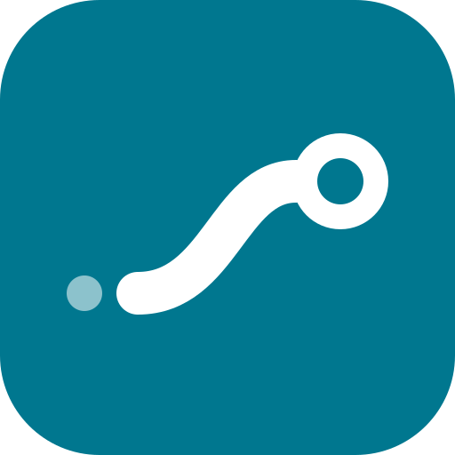
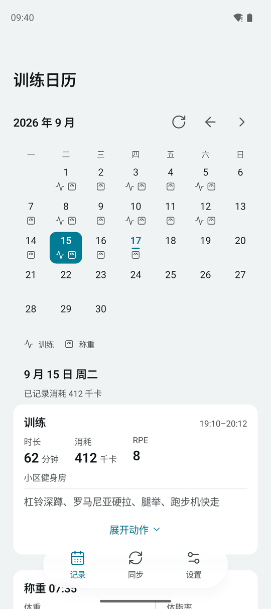
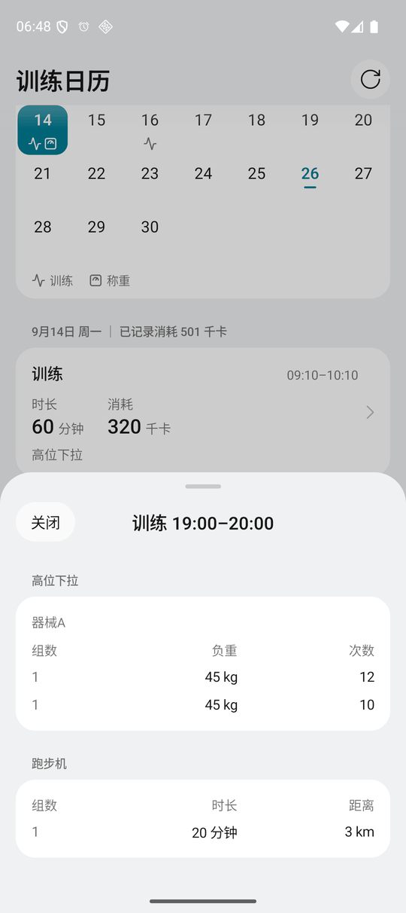
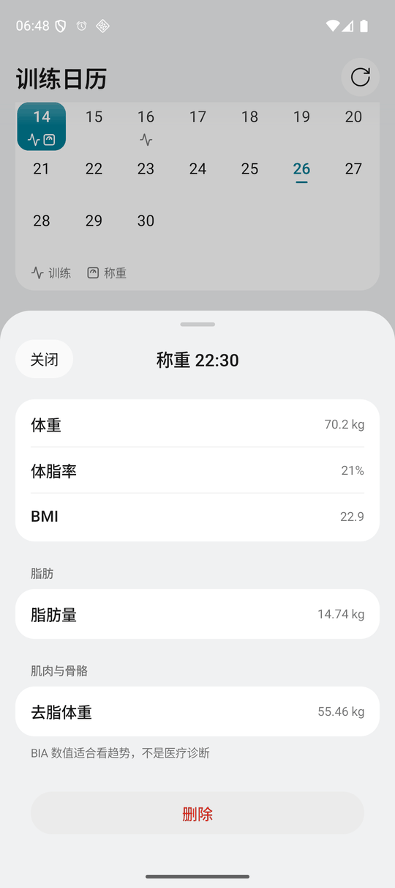
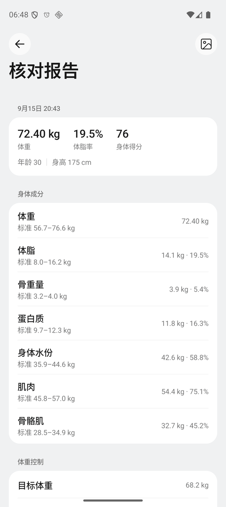

# Kinetrail · 身迹

把体脂秤读数和每一组训练存进自己的数据库，让 ChatGPT 照着事实回答。

[](LICENSE.md)

Kinetrail 是一个远程 MCP 服务器，部署在个人 Cloudflare 账户里（Worker + D1 + KV），通过 MCP 协议接入 ChatGPT。体测和训练放进同一个 D1 数据库，模型查询时读的是库里的记录，不依赖聊天记忆。一套部署只存一个人的数据。

## 称重怎么进来

站上秤就行，不用拿手机。放在秤旁边的一台常开小主机（`gateway/`）经蓝牙只读连秤（沃莱 P3），收到结果帧后在本机算体成分（移植并对账过的厂商算法 WLA37），推到服务端。秤不知道上秤的是谁，服务端把和本人近两周体重差得多的称重挡掉；体重接近的别人会被记进来，在手机 App「身迹」的记录页删掉（物理删除，删了不会被重新推回来）。

更早的做法是 FitDays+ 称完写入手机的 Health Connect，打开「身迹」推送到服务端。这条路还在，但只收网关接手之前的称重。服务端不登录 FitDays 云端：FitDays 同一账号只保留最后一次登录的 token，服务端每同步一次就会把手机上的 App 顶下线。

FitDays+ 并不是每次称重都写 Health Connect。只有在 FitDays+ 里打开对应体脂秤的测量页、站上秤看到手机上的测量动画，那次称重才会写进去。秤端缓存后补传的称重走的是另一条代码路径，不调用 Health Connect。

## 训练怎么进来

在 ChatGPT 对话里说完成了什么，模型调用 MCP 工具逐组写入。只记明确说已经完成的内容，计划、建议、假设、引用别人说的都不写入。这条约束写在工具说明和 ChatGPT 项目说明里。服务端无法判断一条训练是否真的完成，但事实表有触发器禁止删除和改写，修改一条训练是写新版本，旧值保留。

手表消耗热量在结束训练时写入，手表数据不经过 Health Connect。

下面是一段示意对话，**所有数字都是编的**：

> **用户**：今天练腿。深蹲 80 公斤 5 组 5 次，最后一组 RPE 9；腿举 120 公斤 3 组 12 次。
>
> **ChatGPT**：<sub>`记录已完成训练`</sub><br>已保存：深蹲 5 组、腿举 3 组。
>
> **用户**：练完了。手表显示 62 分钟，消耗 410 千卡。
>
> **ChatGPT**：<sub>`结束训练会话`</sub><br>本次训练已结束，时长 62 分钟、消耗 410 千卡已记录。
>
> **用户**：第三组深蹲其实是 75 公斤。
>
> **ChatGPT**：<sub>`修正训练记录`</sub><br>已更正为 75 公斤，原来的 80 公斤作为旧版本保留。
>
> **用户**：最近四周体重和体脂怎么走的？深蹲有进步吗？
>
> **ChatGPT**：<sub>`体测趋势` `训练趋势`</sub><br>四周里有 19 天称过重。按每天的中位数算，周均体重从 72.4 kg 降到 71.1 kg，体脂率从 24.8% 降到 23.9%。深蹲 5 次组的估算 1RM 从 88 kg 升到 93 kg（Epley 公式估算，不是实测）。

写入工具只有返回「已提交」才算存上。网络超时时模型用同一个幂等键查收据，确认到底存没存，不会重复记一遍。

## 报告识图

Health Connect 里只有体重、体脂率、骨量、基础代谢这些基础读数。FitDays+ 的人体成分分析报告图片上还有肌肉率、内脏脂肪、分段脂肪和阻抗，所以手机 App 加了本机识图。

识别用打包在 APK 里的 ML Kit 离线运行，图片不离开手机，请求里只有数字。ML Kit 在中文衬线字体上的已知识别问题包括：

- 形近字误读（体→休、控→挖、龄→齡 等）
- 小数点丢失（157.7% 读成 1577%）
- 多认或漏认字符

解析器容忍一处形近字，丢掉的小数点按报告固定的小数位补回来（报告里的质量和比例固定一位小数，成分表里的体重两位）。核对页做了报告内部的交叉校验（成分质量与百分比、去脂体重、BMI、阻抗随频率下降等），有字段没认出或对不上就不让上传。

## 手机 App

「身迹」在 [`android/`](android/)，Kotlin + Jetpack Compose。底栏三页：记录（训练日历，称重卡片可以永久删除这次称重）、同步（Health Connect 读取与报告识图）、设置。

打开 App 自动同步一次。在 FitDays+ 报告页点分享选「身迹」或从相册选图，进入识图核对。推送令牌在电脑上生成、用 adb 写入手机，服务端只存它的 SHA-256。没有后台任务，称完打开一次就行。

以下截图在模拟器上用合成数据拍摄，不含真实体测读数。

<table>
<tr>
<td></td>
<td></td>
</tr>
<tr>
<td></td>
<td></td>
</tr>
</table>

## MCP 工具

共 18 个。第一次连接只申请 `body:read` 和 `workout:read` 两个只读权限，模型第一次写训练时 ChatGPT 再引导补授权 `workout:write`。

读工具只看已发布的数据快照，查询不触发同步。输入、输出和日志都经过秘密检查，账户凭据和令牌不会出现在工具结果里。完整的输入输出 schema、分页、幂等和错误码见 [MCP 契约](MCP_CONTRACT.md)。

<details>
<summary>体测（只读，8 个）</summary>

| 工具 | 说明 |
| --- | --- |
| `get_latest_measurement_full` 最新完整体测 | 最新一次有效体测的完整原始记录 |
| `get_measurements` 体测记录 | 按时间范围分页读取，支持 summary 和 full |
| `get_trend` 体测趋势 | 按自然日中位数再聚合，支持周期值、7 日均线、环比 |
| `get_sync_status` 同步状态 | 最后一次成功写入时间、覆盖范围、各数据集计数 |
| `get_raw_dataset` 原始数据集 | 八类测量数据集的脱敏原始记录 |
| `get_raw_record_chunk` 原始记录分块 | 分块读取超过响应上限的原始记录 |
| `list_profiles` 测量成员 | 成员列表（一套部署通常只有一个人） |
| `list_devices` 测量设备 | 设备型号与固件，不含 MAC 或序列号 |
</details>

<details>
<summary>训练（读 4 个 + 写 5 个）</summary>

| 工具 | 说明 |
| --- | --- |
| `get_open_workout_sessions` 未结束的训练会话 | 记录前先调用，拿到 session_id 和 revision |
| `get_workout_history` 训练历史 | 逐组力量数据、有氧数据、原话、修订版本 |
| `get_training_trend` 训练趋势 | 按动作分组的训练量、估算 1RM、有氧时长和距离 |
| `get_write_receipt` 写入收据 | 超时后查某次写入到底存没存 |
| `start_workout_session` 开始训练会话 | 到场时建空会话，不记已完成的组 |
| `record_workout_event` 记录已完成训练 | 原子新增完成事实，逐组填写 |
| `finalize_workout_session` 结束训练会话 | 附整场时长、消耗热量、RPE |
| `reopen_workout_session` 重新打开训练会话 | 结束后要继续时重开 |
| `amend_workout_entry` 修正训练记录 | 纠正或撤回，生成新版本，旧值保留 |
</details>

<details>
<summary>综合（1 个）</summary>

| 工具 | 说明 |
| --- | --- |
| `get_progress_overview` 体测与训练概览 | 同一时间窗并列体测趋势和训练趋势 |
</details>

## 部署

一套部署只存一个人的数据，想用就在自己的 Cloudflare 账户里部署一套。需要准备：

- Cloudflare 账户，有一个托管在同账户的域名，开通了 Zero Trust（登录走 Access for SaaS）
- Android 14 及以上的手机，有 Health Connect，装了 FitDays+ 并打开了写入 Health Connect
- 能打开 Developer mode 的 ChatGPT 账户
- 电脑上 Node 22.12 以上；构建 App 另需 Android Studio 自带的 JDK 和 Android SDK

大致步骤：创建 D1 和 KV，填配置，建 Access 应用写 secrets，迁移数据库并发布 Worker，在 ChatGPT 添加插件并绑定身份，构建安装手机 App，生成推送令牌并试称一次。每一步的命令和排错都在[运维手册第 2 节](docs/operations.md#2-从零部署)。

仓库里的 `wrangler.jsonc` 全是占位符，真实的账户、域名和资源 ID 只存在本机的 `wrangler.local.jsonc`（git 忽略）。

## 当前限制

- 网关只适配了沃莱 P3，而且分不出上秤的是谁：体重接近本人的别人会被记进来，要在手机上删。
- 网关主机关着的时候上秤，那次称重进不来。秤会不会把没人取走的结果缓存下来、下次补发给网关，还没实测。
- 2026-09-15 以前从 FitDays 同步的旧称重不能在手机上删（它们连着的阻抗记录，关联规则还没验证）。
- 小米体脂秤 S800 还没适配，设置里只是占位。想接入的话看[适配指南](docs/xiaomi-s800.md)。
- 只在 ChatGPT 上接入验证过，其他 MCP 客户端没测。ChatGPT 连接时会冻结工具定义，服务端改了工具后可能要删掉插件重新添加才能生效，详见[运维手册](docs/operations.md)。

## 开发

需要 Node 22.12 以上。依赖版本全部固定，提交 lockfile。

```bash
npm ci
npm run check
```

`npm run check` 依次运行 Biome lint、TypeScript 类型检查、Vitest（在 workerd 中，D1/KV 为本地模拟）和仓库秘密扫描。单独运行：`npm run lint`、`npm run typecheck`、`npm test`、`npm run scan`。修改 `wrangler.jsonc` 后运行 `npm run types`。

手机 App 的构建和安装见 [`android/README.md`](android/README.md)。

仓库是公开的：提交里不放真实体测读数和部署标识。测试里的体测数值全部是合成数据，识图样本保留真实报告的版式和读错方式，数字已替换。

## 文档

| 文档 | 内容 |
| --- | --- |
| [运维手册](docs/operations.md) | 从零部署、验收、升级回滚、加密备份与恢复、凭据轮换、故障排查 |
| [架构决策](ARCHITECTURE_DECISION.md) | 为什么选 Worker + D1 + Access |
| [数据契约](DATA_CONTRACT.md) | 数据集、版本与删除规则、训练状态机、单位换算、趋势公式 |
| [MCP 契约](MCP_CONTRACT.md) | 工具、权限、分页、幂等、错误码、ChatGPT 项目说明 |
| [Health Connect 方案](research/HEALTHCONNECT.md) | 从 FitDays 云端拉取改成手机推送的评估与实测 |
| [手机 App](android/README.md) | 同步、识图、日历、界面与构建 |
| [体脂秤网关](gateway/README.md) | 在常开主机上装网关：蓝牙固件、配置、排查 |
| [沃莱 P3 协议与算法](research/P3.md) | BLE 帧格式与 WLA37 移植、对账 |
| [适配小米体脂秤 S800](docs/xiaomi-s800.md) | 给新体脂秤接入称重和报告识图的步骤 |

## 协议

[PolyForm Noncommercial License 1.0.0](LICENSE.md)。个人学习研究、兴趣项目可以使用、修改和分发，慈善组织、教育和公共研究机构、政府机构也可以用；商业用途不在授权范围内。这不是 OSI 定义的开源协议。第三方组件保留各自的协议，见 [THIRD_PARTY_NOTICES.md](THIRD_PARTY_NOTICES.md) 和 [android/THIRD_PARTY_NOTICES.md](android/THIRD_PARTY_NOTICES.md)。
