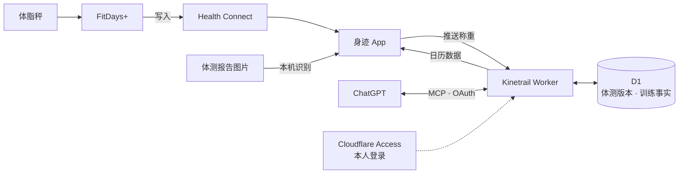

<div align="center">


# Kinetrail · 身迹

**把体脂秤读数和每一组训练存进你自己的数据库，让 ChatGPT 照着事实回答。**

[](LICENSE.md)
[](https://developers.cloudflare.com/workers/)
[](android/README.md)
[](MCP_CONTRACT.md)

[用起来的样子](#用起来的样子) · [工作方式](#工作方式) · [手机 App](#手机-app) · [MCP 工具](#mcp-工具) · [部署](#部署) · [运维手册](docs/operations.md)

</div>

---

体脂秤 App 里攒着几年的称重，训练散落在一段段聊天里。问 ChatGPT「这个月体脂降了多少」「上周深蹲做了几组」，它只能翻聊天记忆去拼，拼不出来就容易编。

Kinetrail 是部署在你自己 Cloudflare 账户里的远程 MCP 服务器。它把体测和训练放进同一个数据库，再接进 ChatGPT：

- 用 FitDays+ 称完，打开手机上的「身迹」，这次称重就推到服务器。体测报告图片在手机本机识别，能补上肌肉、内脏脂肪和分段读数。
- 在对话里说一句「刚做完深蹲 80 公斤 5×5」，模型会逐组写进库。记错了可以改，旧版本会留着。
- 趋势、训练量和估算 1RM 由服务端按固定公式计算，每个数字都附样本数和缺失数，模型不用自己心算。
- 身迹的日历按天列出训练、消耗热量和体脂秤读数。

## 用起来的样子

下面是示意对话，数字都是编的。

```text
我：今天练腿。深蹲 80 公斤 5 组 5 次，最后一组 RPE 9；腿举 120 公斤 3 组 12 次。
ChatGPT：（记录已完成训练）已保存：深蹲 5 组、腿举 3 组。

我：练完了。手表显示 62 分钟，消耗 410 千卡。
ChatGPT：（结束训练会话）本次训练已结束，时长 62 分钟、消耗 410 千卡已记录。

我：第三组深蹲其实是 75 公斤。
ChatGPT：（修正训练记录）已更正为 75 公斤，原来的 80 公斤作为旧版本保留。

我：最近四周体重和体脂怎么走的？深蹲有进步吗？
ChatGPT：（体测趋势、训练趋势）四周里有 19 天称过重。按每天的中位数算，周均体重从 72.4 kg
        降到 71.1 kg，体脂率从 24.8% 降到 23.9%。深蹲 5 次组的估算 1RM 从 88 kg 升到 93 kg
        （Epley 公式估算，不是实测）。
```

写入工具只有返回「已提交」才算存上；网络超时的话，模型用同一个幂等键查收据，确认到底存没存，不会重复记一遍。

## 工作方式



一个 Cloudflare Worker 对外开三个入口：

| 入口 | 谁在用 | 鉴权 |
| --- | --- | --- |
| `/mcp` | ChatGPT 读体测、读写训练 | OAuth，登录走 Cloudflare Access，服务端只认绑定好的本人身份 |
| `POST /ingest/health-connect` | 身迹推送称重和识图报告 | 设备令牌，服务端只存它的 SHA-256 |
| `GET /app/calendar` | 身迹的训练日历 | 同一个设备令牌，只读 |

数据存在 D1，OAuth 状态存在 KV，没有常驻服务器要维护。早期版本从 FitDays 云端只读拉取体测，因为每次登录都会把手机 App 顶下线而停用，那段历史仍在库里，和手机推送的数据接在同一条趋势上。

### 体测

| 来源 | 读数 |
| --- | --- |
| 每次称重（Health Connect） | 体重、体脂率、水分、骨量、基础代谢、去脂体重、心率；BMI 按配置的身高推算 |
| 体测报告（可选，手机识图） | 肌肉率、骨骼肌率、蛋白质、皮下脂肪、内脏脂肪等级、身体年龄、SMI、腰臀比；分段脂肪与肌肉、阻抗保存在原始记录里 |

- 原始记录按版本无损保存。Health Connect 里已经入库的值不可变，在系统里删掉的记录同步成删除版本，不物理删除。
- 识图用打包在 APK 里的 ML Kit 离线跑，图片不离开手机，请求里只有数字。
- 核对页会做报告内部的交叉校验（成分质量与百分比、去脂体重、BMI、阻抗随频率下降等），有字段没认出或对不上就不让上传。
- 报告只挂到同一分钟、体重相同的那一次已入库称重上，挂上后不可改，也不覆盖 Health Connect 已有的值。

### 训练

- 只记你明确说已经完成的训练，计划、建议、假设都不写。这条写在工具说明和 ChatGPT 项目说明里。
- 逐组保存负重、次数、时长、距离、RPE、RIR 等，连同你的原话。没说的留空，不补默认值。
- 公斤和磅、公里和英里都保留原值，另存换算后的标准值；认不出的单位只保留原值，不参与跨单位统计。
- 修正和撤回生成新版本，旧值留着。事实表由数据库触发器禁止删除和改写。
- 手表的整场时长、消耗热量在结束训练时写入；手表数据不经过 Health Connect，把截图发给模型就行。

### 分析口径

- 体测趋势按自然日（默认 Asia/Shanghai）计算：先取每天的中位数，再对有数据的日子等权平均。脂肪量和去脂体重在每次称重时先算好再汇总，不用周均体重乘周均体脂。
- 训练量只统计能确认外加负重和次数的组，按 Σ(kg × 次数) 计算，热身组单列；器械不明时不合并。
- 估算 1RM 用 Epley 公式，只算 2 到 10 次的组，结果标为估算。
- 每个指标附样本数、有效天数、缺失数和公式版本，缺的数据不当 0。体测和训练可以并排对照，但不做因果或医疗判断。

## 手机 App

「身迹」在 [`android/`](android/)，Kotlin + Jetpack Compose，底栏三页：

- **记录**：训练日历。日期下用图标标出训练和称重，点开一天看当天消耗、逐组训练表格和体脂秤读数卡片；看过的月份没网也能翻。
- **同步**：打开 App 自动同步一次，也可以手动点。在 FitDays+ 报告页点分享选「身迹」，或者从相册选图，就进入识图核对。
- **设置**：默认首页、体测报告版式、推送令牌。

推送令牌用 Android Keystore 里不可导出的密钥加密保存，只走 HTTPS，日志里不打印令牌和体测数值。没有后台任务，称完打开一次就行。

## MCP 工具

共 18 个，分三个权限：`body:read`、`workout:read`、`workout:write`。第一次连接只申请两个只读权限，模型第一次写训练时 ChatGPT 再引导你补授权。

| 分组 | 工具 |
| --- | --- |
| 体测 | 最新完整体测 `get_latest_measurement_full`<br>体测记录 `get_measurements`<br>体测趋势 `get_trend`<br>同步状态 `get_sync_status`<br>原始数据集 `get_raw_dataset`<br>原始记录分块 `get_raw_record_chunk`<br>测量成员 `list_profiles`<br>测量设备 `list_devices` |
| 训练查询 | 未结束的训练会话 `get_open_workout_sessions`<br>训练历史 `get_workout_history`<br>训练趋势 `get_training_trend`<br>写入收据 `get_write_receipt` |
| 训练写入 | 开始训练会话 `start_workout_session`<br>记录已完成训练 `record_workout_event`<br>结束训练会话 `finalize_workout_session`<br>重新打开训练会话 `reopen_workout_session`<br>修正训练记录 `amend_workout_entry` |
| 综合 | 体测与训练概览 `get_progress_overview` |

读工具只看已发布的数据快照，查询不会触发任何同步。输入、输出和日志都经过秘密检查，账户凭据和令牌不会出现在工具结果里。输入输出 schema、分页、幂等和错误码见 [MCP 契约](MCP_CONTRACT.md)。

## 部署

Kinetrail 一套部署只存一个人的数据，想用就在自己的账户里部署一套。需要准备：

| 需要 | 说明 |
| --- | --- |
| Cloudflare | 账户、托管在同一账户的域名、Zero Trust 组织（登录用 Access for SaaS） |
| 手机 | Android 14 及以上，有 Health Connect；从 Google Play 安装的 FitDays+，并在里面打开写入 Health Connect |
| ChatGPT | 能打开 Developer mode 的账户 |
| 电脑 | Node ≥ 22.12；构建 App 另需 Android Studio 自带的 JDK 和 Android SDK |

大致步骤如下，每一步的命令和排错都在 [运维手册第 2 节](docs/operations.md#2-从零部署)：

1. 创建 D1 和 KV，复制出 `wrangler.local.jsonc` 填入自己的账户和域名。仓库里的 `wrangler.jsonc` 只有占位符。
2. 在 Zero Trust 里建 Access for SaaS（OIDC）应用，写入 secrets。
3. 迁移数据库，发布 Worker，做冒烟检查。
4. 在 ChatGPT 里添加插件，第一次登录拿到自己的身份标识，绑定后重新发布、正式授权。
5. 填服务端地址，构建并安装身迹，生成推送令牌，称一次试试。

然后按运维手册第 3 节的验收关卡逐项确认。备份、凭据轮换、故障排查和彻底删除也在运维手册里。

## 当前限制

- 称重来源目前只有 FitDays+。只有在 FitDays+ 测量页出现测量动画的称重才会写进 Health Connect，秤端缓存后补传的读不到；FitDays+ 也只写账户主用户。
- 小米体脂秤 S800 还没适配，设置里只是占位。想动手接入的话看 [适配指南](docs/xiaomi-s800.md)。
- 没有后台同步，称完要打开一次身迹。
- 只在 ChatGPT 上接入验证过，其他 MCP 客户端没测。ChatGPT 连接时会记住工具定义，服务端改了工具后可能要删掉插件重新添加。

## 开发

需要 Node ≥ 22.12。依赖版本全部固定，提交 lockfile。

```bash
npm ci
npm run check
```

`npm run check` 依次运行 Biome lint、TypeScript 类型检查、Vitest（在 workerd 中，D1/KV 为本地模拟）和仓库秘密扫描。单独运行：`npm run lint`、`npm run typecheck`、`npm test`、`npm run scan`。修改 `wrangler.jsonc` 后运行 `npm run types`。

生产 bundle 互通检查（需要网络下载 Node 22.23.2）：

```bash
cd research/spike
npm ci --ignore-scripts
npx --yes --package=node@22.23.2 node production-inspector-check.mjs
```

手机 App 的构建、单测和安装见 [`android/README.md`](android/README.md)。

仓库是公开的：提交里不放真实体测读数和部署标识。`sanitized-fixtures/` 与测试里的体测数值全部是合成数据；识图样本保留真实报告的版式和读错方式，数字已替换。`research/spike/worker.mjs` 含合成测试授权入口，禁止部署。

<details>
<summary><b>目录结构</b></summary>

```text
src/
  index.ts         Worker 入口：OAuth Provider、授权页路由、SyncScheduler（DO alarm）与 cron
  auth.ts          Access OIDC 本人绑定、consent、JWT 验签
  mcp.ts           无状态 Streamable HTTP（JSON-RPC）、工具注册、scope、限流、信封、输出检查
  schemas.ts       MCP 契约 schema（与 research/mcp-schemas.json 逐项一致）
  tools.ts         18 个工具的中文标题、描述与处理函数
  ingest.ts        Health Connect 推送入口：设备令牌、严格校验、合并与识图报告
  calendar.ts      手机日历的只读入口（GET /app/calendar），与推送共用设备令牌
  fitdays.ts       FitDays 只读适配：固定路由、manual redirect、预算、原文捕获
  sanitize.ts      秘密边界：采集阻断/脱敏与输出二次检查
  measurements.ts  测量解析、版本、分块、暂存与原子发布
  sync.ts          同步任务队列、lease/fencing、冷却、定时补偿
  queries.ts       体测查询、快照游标、分块读取、同步状态
  workouts.ts      训练写入事务与历史查询
  trends.ts        体测趋势 trend_v1、训练趋势 training_v1、同期概览
  cursor.ts        HMAC 签名游标
  ratelimit.ts     D1 原子限流
  util.ts          错误码、摘要、无损 JSON、时区日历、脱敏日志
android/           手机 App「身迹」
migrations/        D1 schema（事实表带禁止删除/改写触发器）
tests/             Vitest（workerd）测试
scripts/           秘密扫描、加密备份/恢复、许可证清单
docs/              运维手册、小米 S800 适配指南
research/          离线研究、契约生成器与互通检查（不是生产代码）
assets/            图标（icon.svg 源文件、icon-256.png 供 ChatGPT 插件上传，限 PNG ≤10 KB）
```

</details>

## 文档

| 文档 | 内容 |
| --- | --- |
| [运维手册](docs/operations.md) | 从零部署、验收关卡、升级回滚、加密备份与恢复、凭据轮换、故障排查、彻底删除 |
| [架构决策](ARCHITECTURE_DECISION.md) | 为什么选 Worker + D1 + Access，以及放弃了什么 |
| [数据契约](DATA_CONTRACT.md) | 数据集、版本与删除规则、训练状态机、单位换算、趋势公式 |
| [MCP 契约](MCP_CONTRACT.md) | 工具、权限、分页、幂等、错误码、ChatGPT 项目说明 |
| [Health Connect 方案](research/HEALTHCONNECT.md) | FitDays+ 写入 Health Connect 的实测与推送设计 |
| [手机 App](android/README.md) | 同步、识图、日历、界面与构建 |
| [适配小米体脂秤 S800](docs/xiaomi-s800.md) | 给新体脂秤接入称重和报告识图的步骤 |
| [实施计划](IMPLEMENTATION_PLAN.md) | 分阶段实现记录 |

## 协议

[PolyForm Noncommercial License 1.0.0](LICENSE.md)。非商业目的可以使用、修改和分发，包括个人学习研究、兴趣项目，以及慈善组织、教育和公共研究机构、政府机构使用；任何商业用途都不在授权范围内。它不是 OSI 定义的开源协议。第三方组件保留各自的协议，见 [第三方许可证](THIRD_PARTY_NOTICES.md) 和 [Android App 第三方声明](android/THIRD_PARTY_NOTICES.md)。
